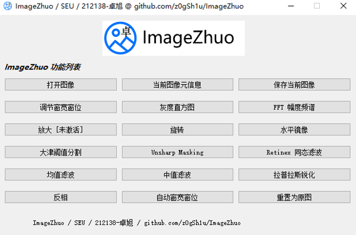

# ImageZhuo

*ImageZhuo 看图软件 / 东南大学研究生《数字图像处理基础》课程实验 / 【丰富功能 & 高可扩展性】*

ImageZhuo 看图软件：支持 4096 级灰度 12 bit 图像。丰富功能 + 高可扩展性。可用于医学 DR 的 raw 图像阅览。



```shell
# Install PyQt5, numpy, matplotlib and nothing more!
# Start with:
start.cmd
```

## 主要功能

窗宽窗位；FFT；旋转、翻转；直方图；元信息查看；大津阈值分割；中值滤波、均值滤波；拉普拉斯锐化；Unsharp Masking；Retinex 同态滤波；局部放大；反相；…

## 设计报告

[./doc/ImageZhuo设计报告.pdf](./doc/ImageZhuo设计报告.pdf)
